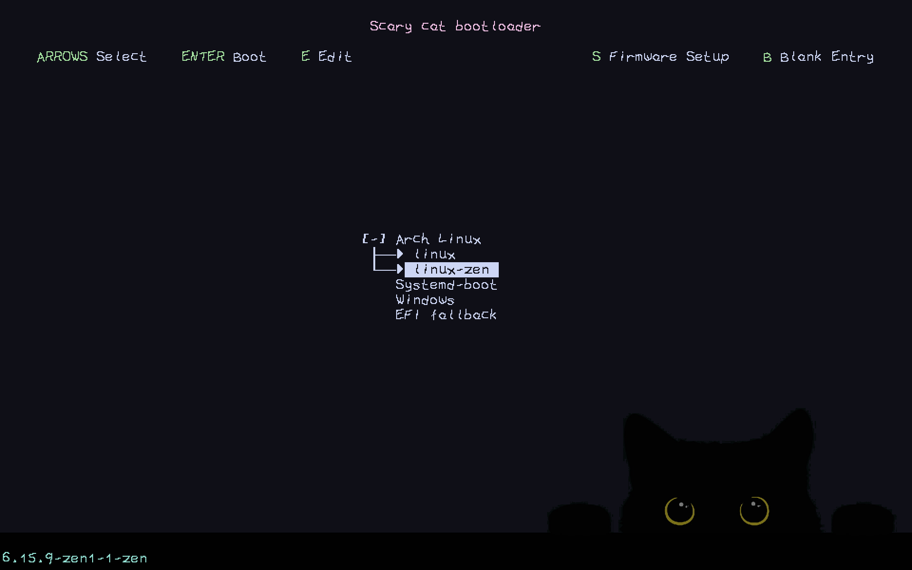
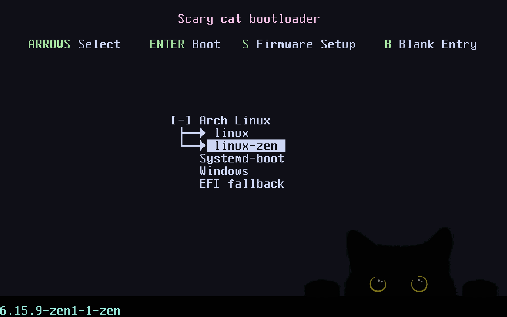

# Scary cat Limine theme

A theme for the [Limine bootloader](https://limine-bootloader.org/).

## Installation

It is assumed that you have already installed the Limine bootloader and you know how to use it. Useful docs:

- The [Arch wiki](https://wiki.archlinux.org/title/Limine) (in particular [this part](https://wiki.archlinux.org/title/Limine#Boot_entry_automation))
- The [CachyOS wiki](https://wiki.cachyos.org/configuration/boot_manager_configuration/#limine)
- The [Limine documentation](https://github.com/limine-bootloader/limine/blob/v9.x/CONFIG.md/)

Then copy the files in the  [`limine`](/limine/) directory to `/boot/EFI/limine/`and add the content of [`limine.conf`](limine.conf) to your `limine.conf` file (usually in `/boot/limine.conf` or `/boot/EFI/limine.conf`).

## Customization

New fonts can be found in the [VGA text mode font](https://github.com/viler-int10h/vga-text-mode-fonts) collection. Just

1. Clone the repository
1. find the one you like in the preview directory
1. Copy the font file to the `/boot/EFI/limine/` directory
1. Modify the `term_font: boot():/EFI/limine/SCRWL---.F16` line in `limine.conf` to `term_font: boot():/EFI/limine/YOUR_FONT.F16`

If the `term_font` line is not present or is commented out, the default font looks like this (also zoomed-in by setting `term_font_scale`to `3x3`):

